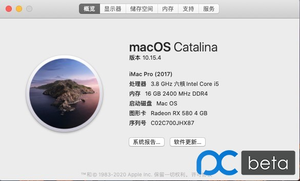
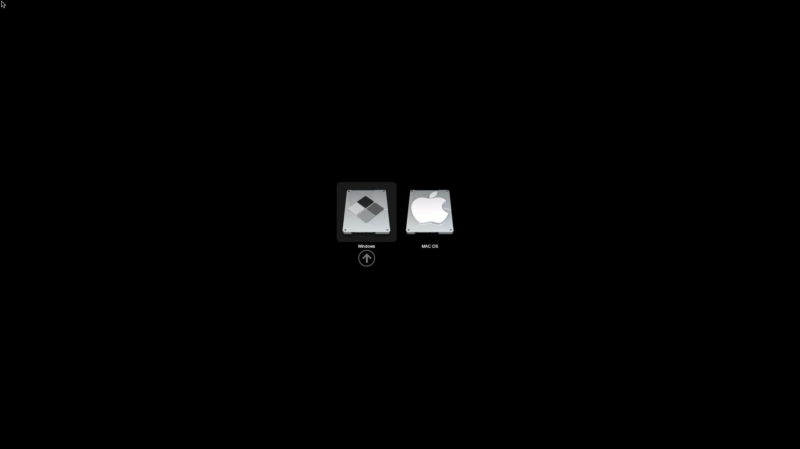
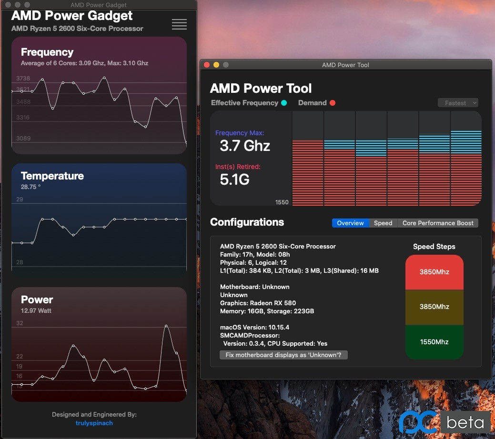

### OC引导文件

<u>当前版本：OC 0.6.1(支持Catalina 15.6、BigSur）</u>

适用于以下主机配置的黑苹果OC引导，使用前请自行更改三码，其它MSI B450主板的如要使用请参考 **其它** 目录

#### 1.配置清单:

| CPU | AMD 2600 |
| :----: | :------: |
| 主板 | B450M MORTAR MAX 迫击炮 |
| 显卡 | 蓝宝石 RX580 |

#### 2.系统截图

#### 3.更新历史

##### 2020.9.1日更新

1.更新OC0.6.1，支持引导BigSur（在正式版未发布前建议使用Catalina 15.6B）

2.更新全部KEXT驱动为最新

3.重新定制USB驱动，解决睡眠唤醒问题

4.添加AMD传感器驱动

5.添加AMD显卡驱动（保持Win下性能）

#### 4.其它

该引导仅在以上配置上进行测试，其它配置还请自测，如果其它MSI B450主板要使用请自定义以下内容

1.网卡内建地址

2.声卡内建地址

3.USB定制

如发现问题可以向我反馈，不是大神，能解决就解决

